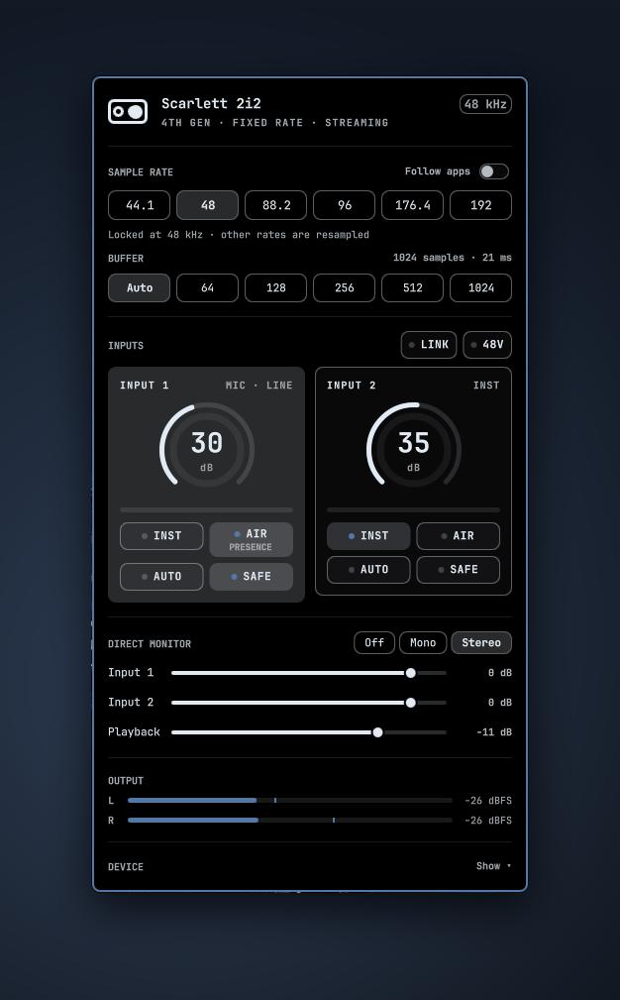
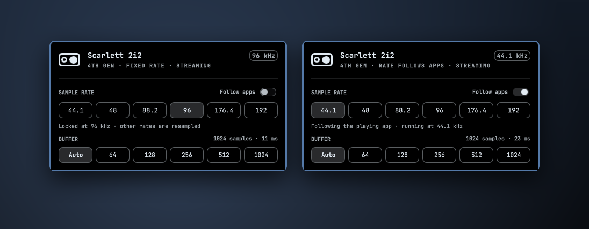
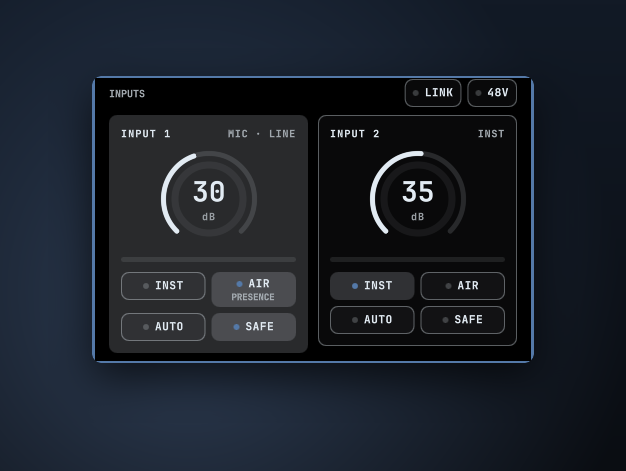
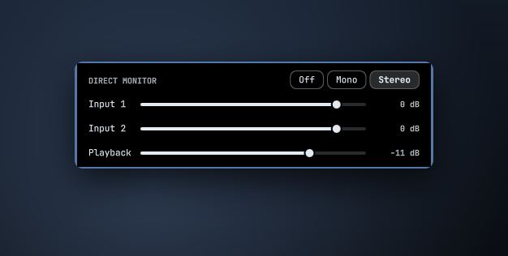
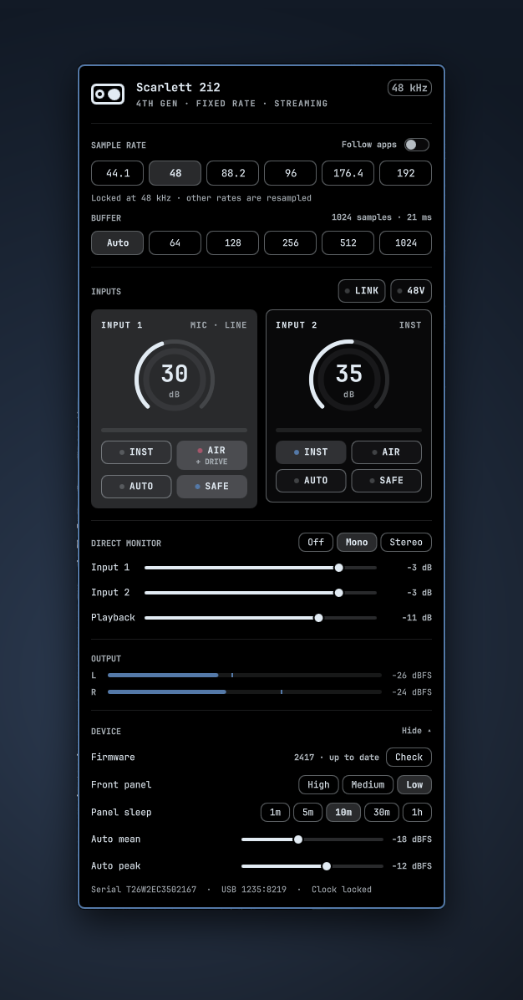
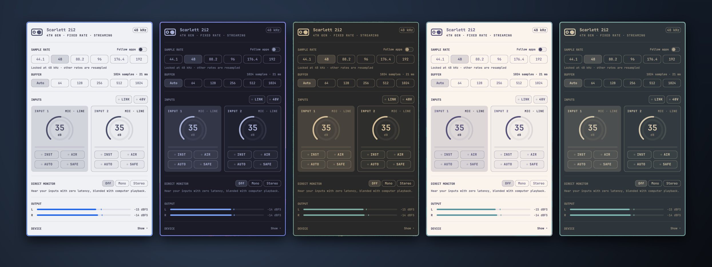
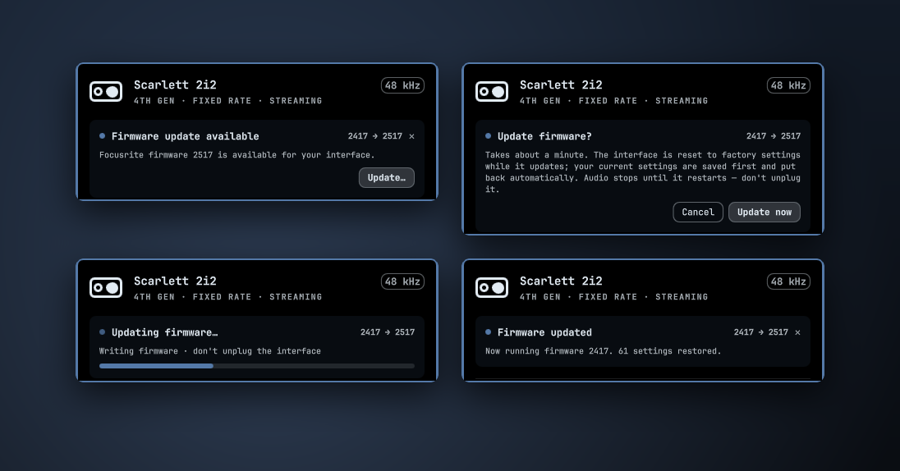
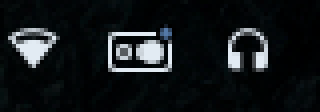

# Scarlett Control for Omarchy

A control center for the **Focusrite Scarlett 2i2 4th Gen** that lives in the
[Omarchy](https://omarchy.org) bar. Pick the **sample rate** and **buffer size**,
set up your preamps, mix direct monitoring, watch live meters and install
**firmware updates** — everything Focusrite Control 2 does on macOS and Windows,
styled by whichever Omarchy theme is active.

<p align="center">
  
</p>

- [Features](#features)
- [Install](#install)
- [Using the panel](#using-the-panel)
- [Firmware updates](#firmware-updates)
- [Keyboard shortcuts](#keyboard-shortcuts)
- [How it works](#how-it-works)
- [Files it writes](#files-it-writes)
- [Remove](#remove)
- [Troubleshooting](#troubleshooting)
- [Compatibility](#compatibility)
- [Development](#development)
- [Credits](#credits)

## Features

| | |
|---|---|
| **Sample rate** | 44.1 · 48 · 88.2 · 96 · 176.4 · 192 kHz, or **Follow apps**, which lets the interface switch to each app's own rate. Changes apply immediately and are kept after a reboot. |
| **Buffer size** | Auto or 64 – 1024 samples, with the resulting latency shown. |
| **Preamps** | A gain knob per input, with a level halo like the one on the hardware, plus a meter and the **Inst**, **Air** (Presence / Presence + Drive), **Auto Gain** and **Clip Safe** buttons. |
| **Shared input controls** | **48V** phantom power and **Link** (use inputs 1 and 2 as a stereo pair). |
| **Direct monitor** | Off / Mono / Stereo, with Input 1, Input 2 and Playback levels. |
| **Meters** | Live output meters and per-input levels. |
| **Device** | Front-panel brightness and sleep time, Auto Gain targets, serial number and clock status. |
| **Firmware** | Shows the installed and newest available version, and installs updates with a progress bar. Your settings are saved before the update and put back afterwards. |
| **Theme aware** | Uses the Omarchy shell's own colours, fonts, spacing and corner rounding, so it changes along with your theme. |
| **Always in sync** | Turning a knob or pressing a button on the interface shows up in the panel straight away. |

## Install

From the [Omarchy plugin marketplace](https://plugins.omarchy.org/), or directly:

```bash
omarchy plugin add https://github.com/PixDevsApps/omarchy-scarlett-control.git --enable
```

The icon appears on the right side of the bar. To place it next to the volume icon:

```bash
omarchy bar move io.github.pixdevsapps.scarlett-control --before omarchy.audio
```

### Requirements

Everything the panel needs is already on a standard Omarchy install:

| Needed for | Provided by |
|---|---|
| Hardware controls | The Linux kernel's built-in Scarlett driver (`snd-usb-audio`, kernel 6.8 or newer), used through `alsa-lib` |
| Sample rate and buffer size | PipeWire (`pw-metadata`) |
| The helper program | Python 3 (standard library only) |

**Firmware updates only** need two extra AUR packages: Geoffrey Bennett's
[`scarlett2`](https://github.com/geoffreybennett/scarlett2) updater and the
[`scarlett2-firmware`](https://github.com/geoffreybennett/scarlett2-firmware)
image files, which Focusrite allows to be redistributed:

```bash
omarchy pkg aur add scarlett2 scarlett2-firmware
```

Without them the rest of the panel works normally, and the Device section tells
you the updater isn't installed.

## Using the panel

Click the Scarlett icon in the bar. The panel is split into sections from top to bottom.

### Sample rate and buffer

<p align="center"></p>

- **Fixed rate (left):** click a rate and the interface switches immediately. Apps that play at a different rate are converted to it.
- **Follow apps (right):** the interface runs at the rate of whichever app starts playing first, so a 44.1 kHz album plays without conversion. PipeWire only changes the rate while nothing is playing.
- The badge at the top always shows the rate the interface is actually running at.
- **Buffer** sets PipeWire's buffer size. Smaller buffers mean lower latency, which suits recording and monitoring through software; larger buffers are more robust. The resulting latency is shown next to the header.

> At 176.4 and 192 kHz the 2i2 turns off Clip Safe and Air Presence + Drive.
> The panel greys those buttons out at those rates.

### Inputs

<p align="center"></p>

- **Gain knob:** drag up or down, or scroll. The inner ring lights up with the incoming signal and turns red-ish as it gets close to clipping.
- **Selecting an input:** click a card to select that input on the interface itself, so the physical knob and buttons control it. The highlighted card is the selected one.
- **Inst:** switches the front jack to instrument level for guitar or bass.
- **Air:** cycles Off → Presence → Presence + Drive.
- **Auto:** runs Auto Gain. Play or sing at performance level for 10 seconds; the result appears under the buttons. Click again to cancel.
- **Safe:** Clip Safe turns the gain down automatically before the signal clips.
- **48V and Link** (next to the INPUTS header) apply to both inputs. 48V turns phantom power on for both XLR inputs, and its light turns red while it's on.

### Direct monitor

<p align="center"></p>

Direct monitoring sends your inputs straight to the headphone and line outputs
with no delay, mixed with computer playback.

- **Mono** puts both inputs in the centre.
- **Stereo** puts input 1 on the left and input 2 on the right.
- The sliders set the Input 1, Input 2 and Playback levels for the mode you picked, and are stored on the interface itself. Right-click a slider to mute or restore that source.

### Device

<p align="center"></p>

Click **Show** (or press `d`) to see:

- the firmware version and update button
- front-panel brightness and sleep time
- Auto Gain mean and peak targets
- the serial number, USB ID and clock status

### Themes

The panel follows your Omarchy theme. It's shown here in Catppuccin Latte,
Tokyo Night, Gruvbox, Rose Pine and Everforest:

<p align="center"></p>

## Firmware updates

<p align="center"></p>

When a newer firmware file is installed on your system, a dot appears on the bar
icon and a banner appears at the top of the panel:

<p align="center"></p>

1. **Update…** explains what is about to happen. Nothing is written until you click **Update now** (or press `u` twice).
2. The panel saves every setting on the interface, then runs `scarlett2 update`, showing reset, erase and write progress.
3. The interface restarts. When it reconnects, the panel writes your settings back and says how many were restored.

**Things to know:**

- **Don't unplug the interface during an update.** Audio stops until it restarts, which takes about a minute.
- **Updating resets the interface to factory defaults.** That's why the panel saves and restores your settings. The PipeWire sample-rate setting is not affected.
- **New firmware arrives with your normal system updates:** when a new version is published, the `scarlett2-firmware` package gets it through `omarchy update`. The panel checks again whenever you open it and every 4 hours.
- **Firmware for Linux can arrive later than Focusrite's own release,** because each version has to be added to `scarlett2-firmware` first.
- **If an update is ever interrupted,** `scarlett2 erase-firmware` returns the interface to its factory firmware, and you can then update again.
- **No elevated privileges are needed.** Your desktop user already has access to the interface's device files.

## Keyboard shortcuts

While the panel is open:

| Key | Action |
|---|---|
| `1` – `6` | Sample rate 44.1 / 48 / 88.2 / 96 / 176.4 / 192 kHz |
| `a` | Toggle **Follow apps** |
| `m` | Cycle direct monitor Off → Mono → Stereo |
| `p` | Toggle 48V phantom power |
| `d` | Show / hide the Device section |
| `u` | Firmware update: review, then press again to start |
| `Tab` / `Esc` | Next bar panel / close |

The panel can also be toggled from a keybinding or script:

```bash
omarchy-shell scarlett-control toggle
```

## How it works

```
 ┌──────────────── omarchy-shell (Quickshell) ────────────────┐
 │  Panel.qml ── bar icon + panel, built from the shell's UI  │
 │     ▲  JSON lines          │ one-line commands             │
 └─────┼──────────────────────┼───────────────────────────────┘
       │                      ▼
   scarlett-ctl daemon  (Python, libasound via ctypes)
       │           │                 │
   ALSA controls   pw-metadata       scarlett2 (firmware, optional)
   of the Scarlett (clock settings)
```

- **Hardware:** the kernel driver already exposes every front-panel control as an ALSA control. `scarlett-ctl` keeps a single connection to the interface open and gets notified whenever a control changes, so knob turns show up immediately. It reads the 12-bit level meters only while the panel is open. Nothing depends on the order the driver numbers its controls in: names, ranges, dB scales and meter routing are all read from the driver.
- **Sample rate:** Linux has no hardware setting for the sample rate; the interface runs at whatever rate PipeWire opens it with. The panel sets PipeWire's rate while it's running (`pw-metadata -n settings 0 clock.force-rate …`, plus `clock.allowed-rates` for Follow apps) and writes a small config file so the choice survives a reboot. This is PipeWire's system-wide rate, so other audio devices use it too.
- **Buffer size:** set with `clock.force-quantum`. It's remembered and applied again when the shell starts.
- **Firmware:** see [Firmware updates](#firmware-updates).
- **UI:** QML that uses only the Omarchy shell's own components (`qs.Ui`, `qs.Commons`), so it takes its colours, fonts, spacing and corner rounding from the current theme. No second Quickshell process is started.

## Files it writes

The plugin writes these files only when you change the matching setting in the panel:

| Path | When | Purpose |
|---|---|---|
| `~/.config/pipewire/pipewire.conf.d/60-scarlett-clock.conf` | You pick a sample rate or Follow apps | Keeps your rate choice after a PipeWire restart or reboot |
| `~/.local/state/omarchy-scarlett/prefs.json` | You pick a sample rate or buffer size | Remembers your choices |
| `~/.local/state/omarchy-scarlett/firmware-restore.json` | During a firmware update | Your saved settings. Deleted once they've been restored |

Hardware settings (gain, Air, 48V, the monitor mix and so on) are stored on the
interface itself, just as when you use its buttons.

## Remove

```bash
omarchy plugin remove io.github.pixdevsapps.scarlett-control
```

To also undo the sample-rate setting and remove saved preferences:

```bash
rm -f ~/.config/pipewire/pipewire.conf.d/60-scarlett-clock.conf
rm -rf ~/.local/state/omarchy-scarlett
omarchy restart audio
```

## Troubleshooting

| Symptom | Fix |
|---|---|
| Icon is dimmed and the panel says **Not connected** | Check that the interface is plugged in and shows up in `aplay -l`. The panel reconnects by itself within 2 seconds of the interface appearing. |
| The sample rate goes back to 48 kHz | Something else may be setting PipeWire's clock, such as another config file in `~/.config/pipewire/pipewire.conf.d/` or a DAW. `./scarlett-ctl clock` shows what PipeWire is currently set to. |
| Follow apps doesn't switch rate | PipeWire only changes the rate while the interface is idle. Stop everything that's playing, then start the app you want to follow. |
| Device section says **updater not installed** | Install the two optional AUR packages (see [Requirements](#requirements)). |
| Something else | Run `./scarlett-ctl state` in the plugin folder for a JSON dump of every control. For panel errors, see the shell log: `qs log -p "$OMARCHY_PATH/shell" --tail 100`. |

## Compatibility

- **Tested:** Focusrite Scarlett 2i2 4th Gen (USB `1235:8219`), firmware 2417, Linux 7.2, PipeWire 1.6, Omarchy Quattro.
- **Other models:** the Solo and 4i4 4th Gen, and many 3rd Gen models, use the same kernel driver. Because the panel reads controls by name, much of it should work on them, but they haven't been tested yet, and their different input counts aren't handled yet. Contributions and reports are welcome.

## Development

Work in a checkout of this repository. `tools/dev-sync.sh` copies the working
tree into `~/.config/omarchy/plugins/` and restarts the shell, and
`omarchy plugin validate .` checks the manifest.

The shell keeps plugin components cached in memory after they first load, so
`dev-sync.sh` restarts the shell to pick up QML changes.

To test the firmware update screens without flashing anything:

```bash
touch ~/.local/state/omarchy-scarlett/fw-simulate
```

This makes the panel pretend a newer firmware exists and runs a fake update that
writes nothing to the interface. Delete the file when you're done.

The helper also works on its own:

```bash
./scarlett-ctl state          # every control + clock, as JSON
./scarlett-ctl rate 96000     # or: rate auto
./scarlett-ctl buffer 256     # or: buffer auto
./scarlett-ctl firmware       # installed / available firmware
```

## Credits

- [Geoffrey D. Bennett](https://github.com/geoffreybennett) wrote the Linux Scarlett driver, the `scarlett2` firmware updater, and the reference [`alsa-scarlett-gui`](https://github.com/geoffreybennett/alsa-scarlett-gui). This plugin would not be possible without that work.
- Built on the [Omarchy](https://omarchy.org) shell and [Quickshell](https://quickshell.org).

Focusrite and Scarlett are trademarks of Focusrite Audio Engineering Ltd. This
project is not affiliated with or endorsed by Focusrite.

## License

[MIT](LICENSE) © 2026 Fredrick Thorsen
